# Troubleshooting your computer

## DISM

This utility scans the system for issues with the Windows Component Store and WinSxS folder. When there is a file that needs repair, it uses Windows Update to download clean versions of those files.

To scan and repair those files, run `DISM /Online /Cleanup-Image /RestoreHealth` from an elevated command prompt.

For more information about running DISM check [this page](https://support.microsoft.com/en-us/help/947821/fix-windows-update-errors-by-using-the-dism-or-system-update-readiness).

## SFC

This utility scans the system for corruption in the system files which may be responsible for irregular operating system behavior.

To run SFC, from am elevated command prompt run `sfc /scannow`. It is recommend to do this after running DISM, to correct any issue with the Component Store before trying to repair the System32 folder.

::: tip Note
If you are running SFC along with [DISM](#dism), you must run [DISM](#dism) first to ensure that the Windows component store is fully repaired before attempting to use SFC. This should increase the likelihood of system files being successfully repaired through SFC.
:::

For more information about SFC, check [this page](https://support.microsoft.com/en-us/help/929833/use-the-system-file-checker-tool-to-repair-missing-or-corrupted-system)

## CHKDSK

This utility checks the file system and file system metadata of a volume for errors.

To use CHKDSK, open Command Prompt (be sure to select 'run as administrator') and type `chkdsk <volume> /f`.
**Replace `<volume>` with the actual volume you want to scan, such as `C:`,** or type `chkdsk /f` to check your C: drive and press <kbd>Enter</kbd> to run the command.
If you are checking drive C:, you may get a warning that CHKDSK cannot lock the partition and the computer needs to restart to continue. To confirm, type `Y` and press enter. CHKDSK will then check the drive the next time you restart your computer.
::: tip Note
If you do not wish to restart your computer, you can run the command `chkdsk` which will check your drive in read-only mode.
:::
For more information about CHKDSK, visit [Microsoft's documentation](https://learn.microsoft.com/en-us/windows-server/administration/windows-commands/chkdsk).

## IPCONFIG

This utility returns the IP configuration of your machine. If the IPv4 address begins with 169.254 it is considered as an APIPA address, and the network card is unable to retrieve an IP address from the DHCP server. Use `ipconfig /release` and `ipconfig /renew` in a command prompt to attempt retrieval of an IP address, otherwise check the DNS settings and drivers in Device Manager.

## Device Manager

When troubleshooting problems with your audio, video outputs or a device you connect into your system you should make sure to check that the drivers for them are properly installed on your system. If your system has recently updated them and they no longer function as desired, you can always roll back the drivers by right clicking the device in Device Manager, going to its Properties > Drivers tab and then clicking Roll Back Driver. If this still does not work well, you may wish to uninstall the drivers and then reboot the system. If you do not see drivers for your device in this utility (e.g. Unknown Device and your system does not register your device), you may wish to install them from the manufacturer's website or the CD provided along with the product.

See [this guide](reinstalling-gpu-drivers#method-3-oem-website) for a list of common graphic manufacturer websites.
Or see [this guide](installing-and-updating-drivers#troubleshooting) for a more in-depth guide for driver troubleshooting.

Be sure to follow the manufacturer's instructions for installing the drivers as some require you to have the device plugged (or unplugged) during the installation.

In a driver's properties you may find it useful to know the driver revision date, and can check for drivers older than that date:

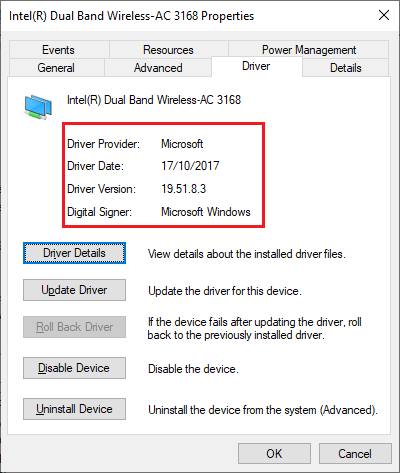

In some cases you may not be able to find the appropriate drivers from the manufacturer's website, but on a third party website instead. Sometimes it doesn't have the correct name. It is strongly not recommended to do this, so proceed at your own risk:

1. Go on the Details tab and change the Property drop down menu contents to Hardware IDs.
2. Right click on the topmost result, copy it and paste it into your desired search engine.
3. If you find anything related to your device, proceed to the website with caution and get the drivers from there.

## System Restore

This utility can be game-saving when it comes to reverting your system back to a better known configuration where the operating system was last stable and applications had run fine. It is usually made whenever you install new drivers and updates, but is turned off by default in Windows. If you want to enable it:

1. Open the Start menu and type in "System Restore". From there it should open up a window like this:

   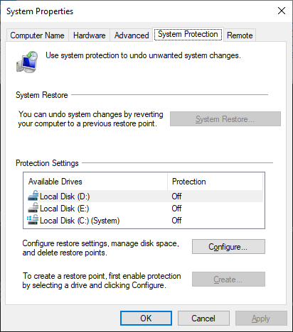

2. Click "Configure" then "Turn on system protection"

   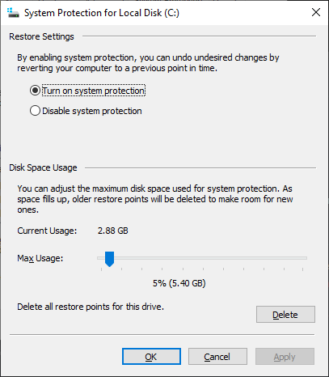

3. After you click OK, you may choose to create restore points by yourself or let Windows create the restore points for you.

   If you want to revert to a known restore point, click "System Restore" and the wizard will load up. Be very careful which restore point you pick, as any programs you've installed after the restore point will be removed, and any programs you've uninstalled will be restored.

   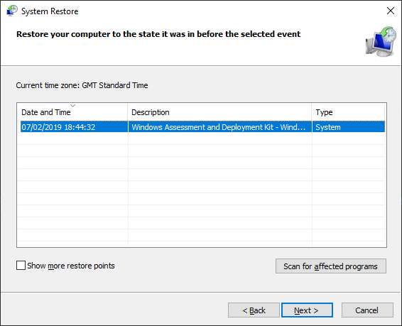

## Reliability history

In some cases where you're experiencing operating system instability or application errors, you can always check Reliability history and Event Viewer to get a better idea of the problem. Uploading a screenshot of a related log in #tech-support may also give the people who are assisting you a better idea of how to approach the problem.

To find the reliability history, search "View reliability history" in the Start menu and click the first result. It will bring up a window similar to this:

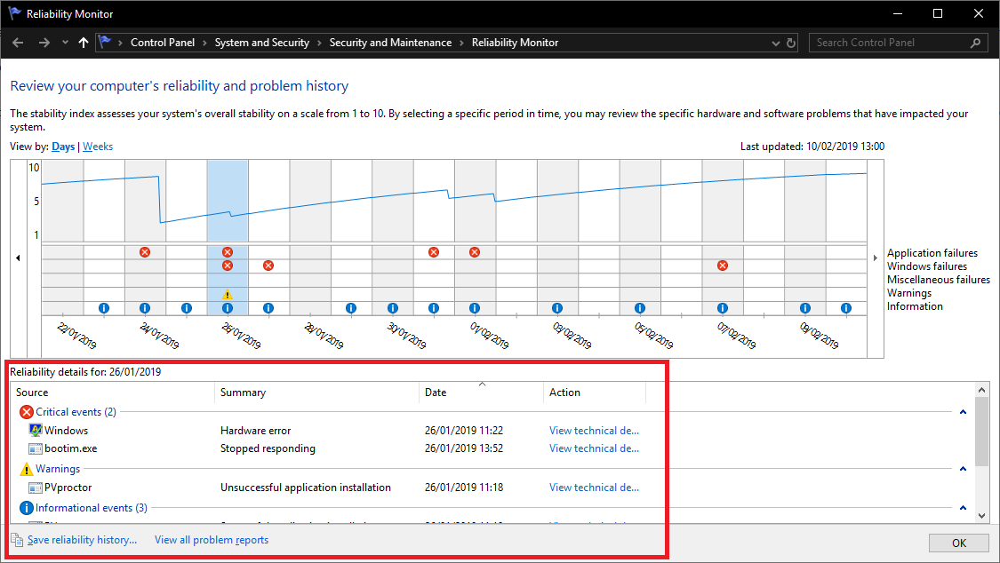

Note that inside the red square there are 3 different categories: informational events, warnings and critical events. They would also show the source (or application) that resulted the event in the history, and clicking "View technical details" would take you to a window like this example, giving you further information on the event and why it happened. It may also help you find solutions if you copied the Problem Event Name.

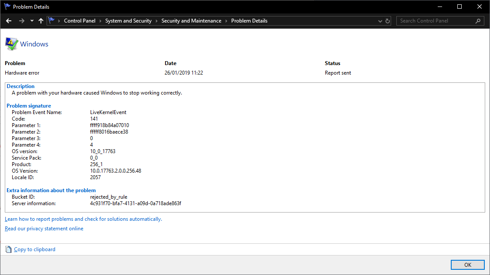

You can also navigate events that happened in the past which may have led to your current problem.

## Event Viewer

Event viewer is slightly more complex, but has further information on the operating system if it is more than one application that is misbehaving. To find this utility, right click the Start menu, click "Event Viewer". Once it opens, notice there are different categories of event logs on the top left corner. Usually you would want to check Application logs, just expand "Windows Logs" then click on "Applications". It would bring up a similar window to this:

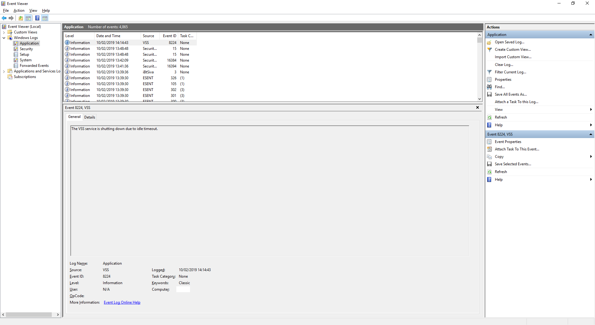

To look for specific types of logs like critical events, warnings or errors, simply click "Filter Current Log" from the top-right corner, and tick the "Critical", "Warning", and "Error" checkboxes.

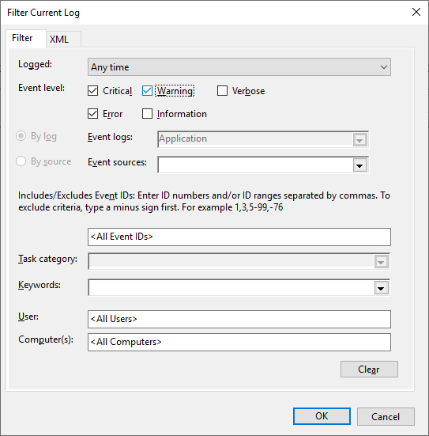

After applying the filter, you may get a window like this. Press down and inspect the logs that were created at the exact time you begun to experience the problems.

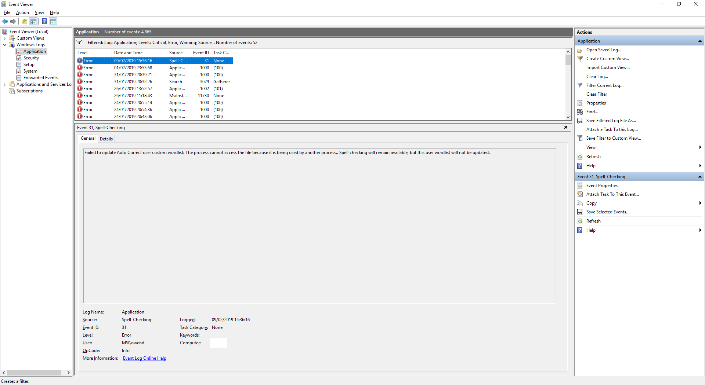

In the general pane, you may copy the first few sentences and paste it in #tech-support or search for a solution on a search engine.

## In-place upgrades

If all else above fails, you can try this method to repair Windows through "in-place upgrades". This will re-install Windows without affecting your programs or data, and is more reliable than resetting Windows in the Settings app, which often relies on an embedded image that can become unstable or unusable.

::: tip Note
You must have a Windows ISO beforehand to do this. If you haven't got one or are unsure, see [Downloading Windows](downloading-windows) for further guidance on getting one.
:::

1. Mount the ISO you downloaded, then run setup.exe.

   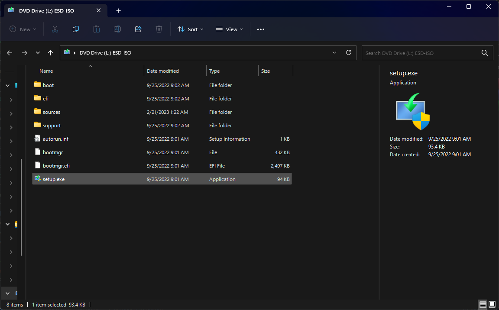

2. The first thing you will see is this screen, select **Change how setup downloads updates**.

   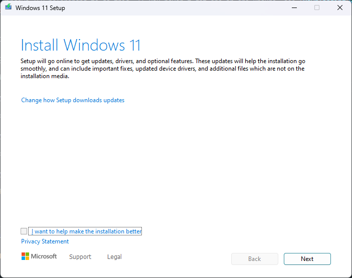

3. On the following screen, select **Not right now**, then Next.

4. After the license agreement page appears, select **Accept**.

   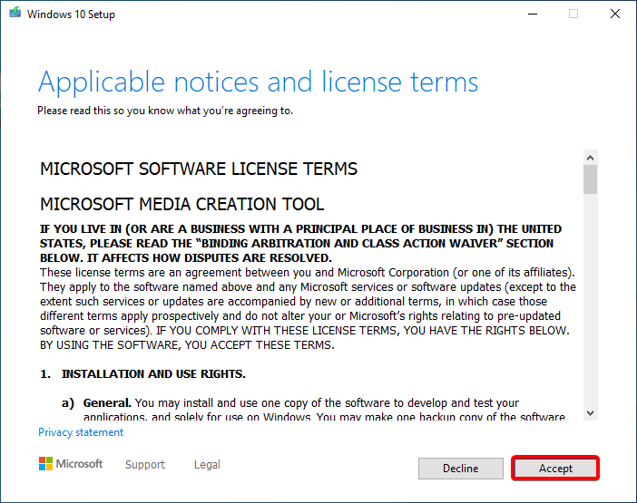

5. This is the final screen you will see before it starts re-installing Windows. Assuming that you want to keep your files, you can just press **Install**.

   ::: tip
   Alternatively, you can click **Change what to keep** and choose either Personal Files and Apps, Personal Files, or Nothing.
   :::

   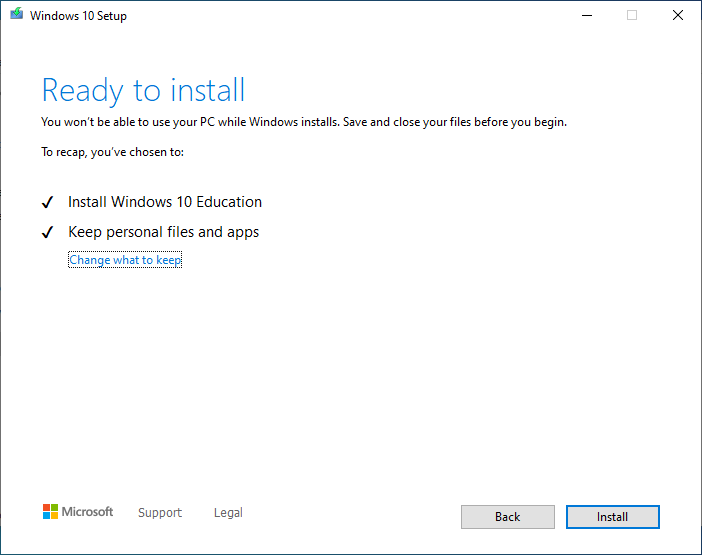

After that, the tool will start repairing Windows.

## Boot issues

Underlying causes for these are abundant, but attempting to narrow the cause down may help you save time and work rather than starting fresh. These methods should get you back in if your blue screen error is related to crucial boot files, but may not work with boot-time drivers, registry corruption or hardware issues.

This wiki assumes you have Windows installed at either `C:\Windows` or `D:\Windows` and the EFI system partition is mounted at `Z:`. Make any necessary changes for commands marked with an asterisk * (but do not add the asterisk to the command itself).

If your system is using legacy BIOS firmware, then proceed with the steps for BIOS below. If you're on UEFI firmware, head to [UEFI](#uefi) instead.

### BIOS

Things may or may not work as intended in this case, but as soon as you get past the bootloader phase everything should work again. Prepare an installation disk and start a command prompt.

Use `bootrec /fixmbr` and `bootrec /fixboot` sequentially. If one of these commands fails, use `bootsect /nt60 c: /mbr`* instead. Then reboot your computer using `wpeutil reboot` or holding the power button.

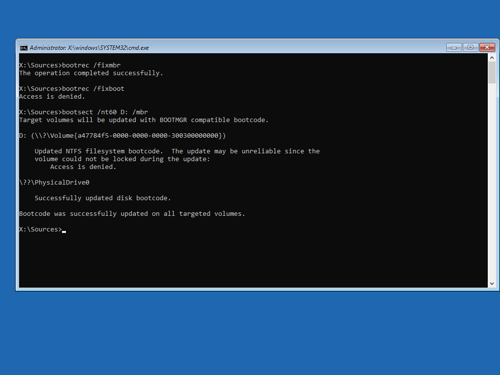

::: tip Note
The `bootsect` command works with different types of Windows NT bootloaders. Windows NT 3.1 up to XP and Server 2003 (NT 5.0-5.2) use NTLDR to load the OS, as such the `nt52` flag must be used. Vista (NT 6.0+) and above use BOOTMGR instead of NTLDR, meaning `nt60` must be used instead of `nt52`.
:::

### UEFI

Fortunately things are much more modular than BIOS over here, and this troubleshooting method has a relatively high success rate (than that of the BIOS method) for the computer to get past the bootloader phase. Similarly, boot an installation disk and start a command prompt.

1. Start DiskPart.

2. Select your system disk, and list its partition using `lis dis`, `sel dis X`* and `lis par`.

3. Select the EFI partition (it should be of System type), format it with FAT32, and assign a letter to it using `assign letter Z`*.

   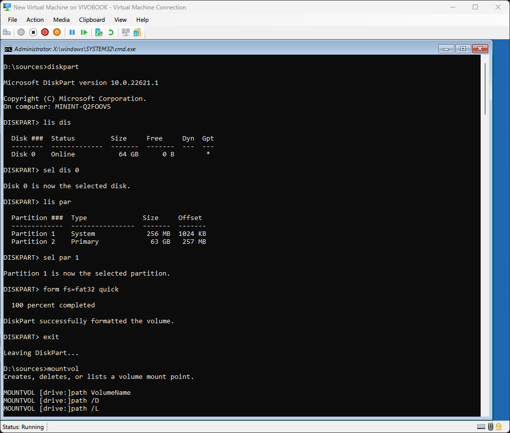

4. (Optional) Use `mountvol` to check that your EFI System partition is mounted where you want it to be.

5. Finally, type `bcdboot C:\Windows /s Z:`*, and `wpeutil reboot` to restart your computer. Windows should now appear.

   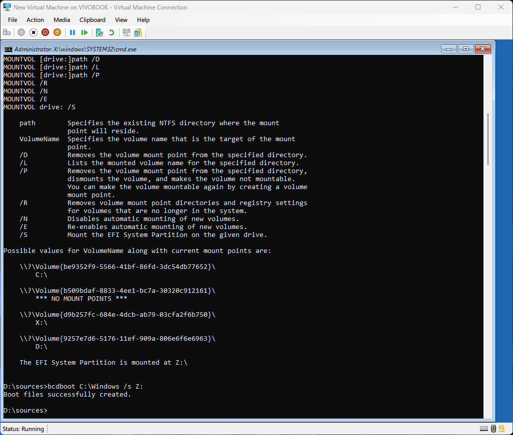
