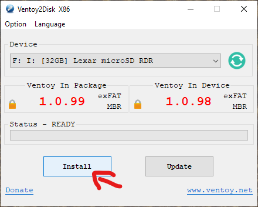

# Creating a Multi-OS Bootable Drive (with Ventoy)
In this article, you will learn how to create a multi-OS bootable drive. 

Having a bootable USB at all times can help you when you need to reinstall an OS, and a multi-OS bootable drive can allow you to install different OS without having to reformat a drive.

## Creation of the USB
This section will teach you how to create a bootable drive for your needs.

::: Warning
Installing Ventoy to create a bootable drive **will wipe all your data from that drive**. Back up your data on the drive before proceeding.
:::
1. Download Ventoy [here](https://www.ventoy.net/en/download.html). This is the tool that we will be using to create a bootable drive.

2. Plug in a USB drive that has at least 8GB.
3. Right click on the file that you have just downloaded and select extract. Then, enter the folder named `ventoy-1.0.xx` and open an application named `Ventoy2Disk.exe`. A UAC prompt will pop-up, click yes.
4. Select a drive in the device selection section. This will be your bootable drive. If you can't see the drive you want to use, press the green button to refresh the list.

5. And the top right of the program click on options and get sure that the secure boot option is enabled and in partition stile select “GPT”.

6. Click install, and Ventoy will create a bootable drive for you. After it finishes, you will see a drive named as "Ventoy", this is where you will place your ISO files for the bootable drive.

## Downloading Windows to the Bootable Drive
### Downloading the ISO file

1. For Windows 10, go to [https://www.microsoft.com/software-download/windows10](https://www.microsoft.com/software-download/windows10)  
To download Windows 11 (Recommended), head to [https://www.microsoft.com/software-download/windows11](https://www.microsoft.com/software-download/windows11)
::: tip
If you are not on Windows, you will see an option to "Select Edition". Select the proper edition, and language, and download the file. Once the download finishes, move the ISO file to the Ventoy drive.
:::

2. Click the **Download Tool Now** button.

   

3. After the tool has been downloaded, run it.

### Using the tool

1. The first thing you will see is this screen, click Accept.

   

2. Wait for the installer to prepare the files needed.

   

3. This is where you select what you want to do.

Select **Create installation media for another PC**, then press next.

    

4. Use the recommended settings, or select your preferred Language, Edition, and Architecture.

::: tip Note
If you're planning to install Windows on another PC and don't know what architecture it uses, then select "Both".
:::

   

5. Select **ISO file**, then press next.

6. Select a path to save to.
### Microsoft Defender Offline
After that, Windows will start downloading the ISO file.

Once the file has been downloaded, copy it to the Ventoy Drive.

::: tip Note
You can read more about reinstalling Windows [here](installing-windows).
:::

If you want to detect and remove any malware or rootkits that your computer has been infected with, you can try the following options.
### Kaspersky
ISOI File: https://www.kaspersky.com/downloads/free-rescue-disk (Not usable in US).
 - Microsoft Defender Offline: [32-bit](https://go.microsoft.com/fwlink/?LinkID=234123), [64-bit](https://go.microsoft.com/fwlink/?LinkID=234124)

After you download the ISO file, copy it to your Ventoy drive.

::: tip Note
The usage is very simple, just you click to update the antivirus databases and run the scan following the instructions on your screen.
:::

## Clonezilla
**Instructions on using Clonezilla are available [here](https://clonezilla.org//clonezilla-live-doc.php).**
Clonezilla is great software for managing (backup and restore, clone)
Download the ISO here :  https://clonezilla.org//downloads/download.php?branch=stable.

::: tip Note
For amd64 choose x86_64. For i686 choose 32-bit.
You also need to select ISO as the filetype.
:::

After that, copy the ISO file to your Ventoy Drive.

::: tip Note
Instructions on using Clonezilla are available [here](https://clonezilla.org//clonezilla-live-doc.php).

## Gparted
Gparted is a powerful tool that helps you to manage partitions, and you can copy them to other disks or inside.
Download the ISO here :  https://gparted.org/download.php.
::: tip Note
For amd64 choose x86_64. For i686 choose 32-bit.
You also need to select ISO as the filetype.
:::

After that, copy the ISO file to your Ventoy Drive.

::: tip Note
Instructions on using Gparted are available [here](https://gparted.org/display-doc.php?name=help-manual).
:::