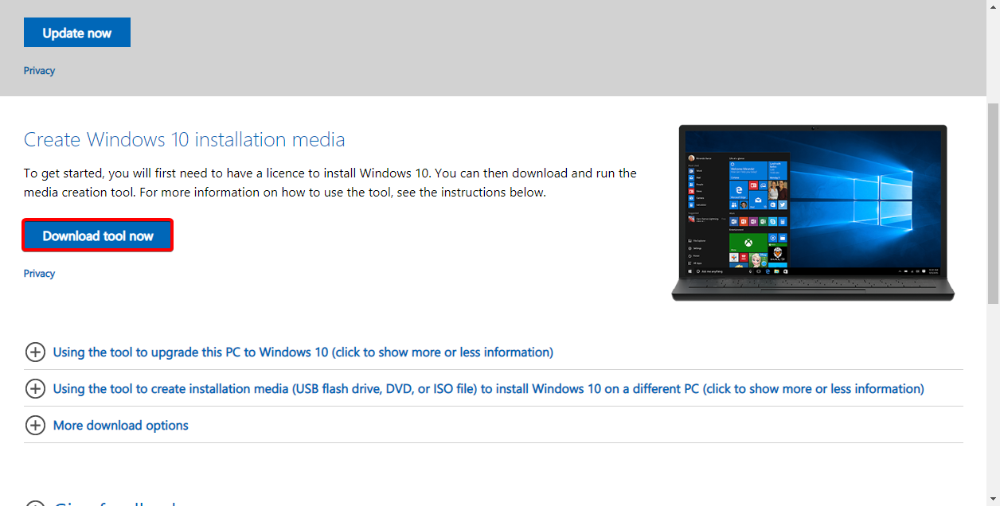
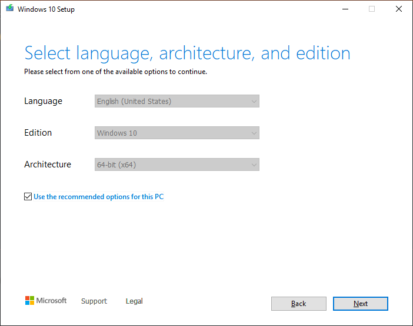

# Creating a Multi-OS Bootable Drive (with Ventoy)
In this article, you will learn how to create a multi-OS bootable drive. 

## Creating the Bootable Drive
This section will teach you how to create a bootable drive for your needs.
1. Download Ventoy [here](https://www.ventoy.net/en/download.html). This is the tool that we will be using to create a bootable drive.
2. Plug in a USB drive that has at least 8GB.
3. Right click on the file that you have just downloaded and select extract. Then, enter the folder named `ventoy-1.0.xx` and open an application named `Ventoy2Disk.exe`. A UAC prompt will pop-up, click yes.
3. Extract the file that you just downloaded. Then, enter the folder named `ventoy-1.0.xx` (where xx is the version of Ventoy that is in the file) and open an application named `Ventoy2Disk.exe`. In the UAC prompt, allow Administrator access to Ventoy by clicking yes.
4. Select a drive in the device selection field. This will be the USB drive where Ventoy will be installed on. If the drive you wish to use is not in the list, try refreshing it by clicking the green button.
This section will teach you how to create a bootable drive for your needs.

::: Warning
6. Finally click install. Ventoy will then make the USB drive bootable. Once it's done, you should see a drive named "Ventoy" in File Explorer. This is where you can place all your ISO files.
:::

## Adding a Windows ISO to your Ventoy drive
3. For this time, we will use the Ventoy2Disk.exe, we click on it, and we click to “yes” in the UAC screen that pooped.
4. Then at devices section select your USB that you want to make a Ventoy or if you can't see it press the green button to refresh the list.
## Downloading Windows to the Bootable Drive
### Downloading the ISO file

6. At the last step, click on install and wait some seconds to get the job done.
For Windows 11, go to [https://www.microsoft.com/software-download/windows11](https://www.microsoft.com/software-download/windows11)

Once the download finishes, move the ISO file to the Ventoy drive.

If you are not on Windows, you will see an option to "Select Edition". Select the proper edition, and language, and download the file. Once the download finishes, move the ISO file to the Ventoy drive.
:::

## Downloading windows
### Downloading the tool for downloading the ISO

1. For Windows 10, go to [https://www.microsoft.com/software-download/windows10](https://www.microsoft.com/software-download/windows10)  
   For Windows 11, go to [https://www.microsoft.com/software-download/windows11](https://www.microsoft.com/software-download/windows11)

2. Click the **Download Tool Now** button.

   
2. Wait for the installer to prepare the files needed.
3. After the tool has been downloaded, run it.

### Using the tool

1. The first thing you will see is this screen, click Accept.
Select **Create installation media for another PC**, then press next.
   

2. The next screen you see will be this, wait for the installer to complete preparation.
4. Use the recommended settings, or select your preferred Language, Edition, and Architecture.
   
::: tip Note
If you're planning to install Windows on another PC and don't know what architecture it uses, then select "Both".
:::
   — You need to click on:**want to reinstall Windows on another computer** click **Create installation media**.

    
5. Select **ISO file**, then press next.
4. Select the correct Architecture, Edition, and Language of Windows, or use the recommended settings.

   ::: tip Note
   If you're planning on installing Windows on another PC and don't know what to select for the architecture, then choose both x86 and x64.
   :::

   
Once the file has been downloaded, copy it to the Ventoy Drive.
5. On the Media Creation Tool, select **ISO file**.
You can use an offline antivirus ISO file to scan your computer for any malware that it may have been infected with.
### Microsoft Defender Offline
ISO File: [32-bit](https://go.microsoft.com/fwlink/?LinkID=234123), [64-bit](https://go.microsoft.com/fwlink/?LinkID=234124)
6. Select a path to save to.
## Downloading Antiviruses
If you want to detect and remove any malware or rootkits that your computer has been infected with, you can try the following options.

 - Microsoft Defender Offline: [32-bit](https://go.microsoft.com/fwlink/?LinkID=234123), [64-bit](https://go.microsoft.com/fwlink/?LinkID=234124)

Download the ISO, and copy it to your Ventoy Drive.
The instructions for installing or reinstalling Windows in your pc are here: [Installing Windows](installing-windows).
:::

## Download the AV
If you want to detect rootkits and malware that got infected in your computer, and you want to clean them, use you can use one you've here listed:
 - Kaspersky: https://www.kaspersky.com/downloads/free-rescue-disk (Not usable in US).
 - Microsoft Defender Offline: https://support.microsoft.com/en-us/windows/help-protect-my-pc-with-microsoft-defender-offline-9306d528-64bf-4668-5b80-ff533f183d6c (head into Windows 8.1 and 7 to know how to download your .iso).

**Instructions on using Clonezilla are available [here](https://clonezilla.org//clonezilla-live-doc.php).**
Download the ISO here :  https://clonezilla.org//downloads/download.php?branch=stable.

::: tip Note
For amd64 choose x86_64. For i686 choose 32-bit.
You also need to select ISO as the filetype.
Copy the downloaded ISO to your Ventoy drive.
:::
Instructions on using Clonezilla are available [here](https://clonezilla.org//clonezilla-live-doc.php).
Instructions on using Clonezilla are available [here](https://clonezilla.org//clonezilla-live-doc.php).
Download the ISO here, selecting your architecture (amd64:  x86_64/
i686=32-bit) and selecting ISO as file type: https://clonezilla.org//downloads/download.php?branch=stable.

Download the ISO here :  https://gparted.org/download.php.
Copy the downloaded ISO to your Ventoy drive.
For amd64 choose x86_64. For i686 choose 32-bit.
You also need to select ISO as the filetype.
:::

Instructions on using Gparted are available [here](https://gparted.org/display-doc.php?name=help-manual).
All the steps using will be covered at: https://clonezilla.org//clonezilla-live-doc.php
:::

## Gparted
Gparted is a powerful tool that helps you to manage partitions, and you can copy them to other disks or inside.
Download the ISO here, selecting your architecture (amd64:  x86_64/ i686=32-bit) and selecting ISO as file type: https://gparted.org/download.php.
With the ISO, send it to your Ventoy USB.

::: tip Note
All the steps using will be covered at: https://gparted.org/display-doc.php?name=help-manual
:::
