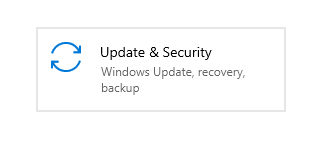
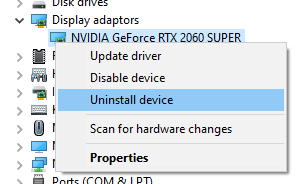
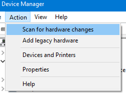
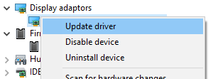

# Reinstalling Graphics Drivers

## Method 1: Windows Update

::: note This method will update Windows and all available drivers, however as a general troubleshooting step this is not a bad idea. :::

1. Open the Settings app. You can do this by searching for it in the Start menu, pressing <kbd>Win</kbd> + <kbd>I</kbd>, or pressing the Settings icon above the power button.

   

2. Select "Update & Security".

   

3. If there are updates available, click "Download". Otherwise, click "Check for Updates".

   

4. Windows should begin looking for any drivers or updates available for your device, including graphics drivers if any are available.

   

## Method 2: Device Manager

> This method may not work effectively on older versions of Windows, if this is the case then use method 3.

1. Open Device Manager by either searching for it in Start, or pressing <kbd>Win</kbd> + <kbd>X</kbd> and tapping <kbd>M</kbd> afterwards.

   

2. Find and expand the "Display adapters" icon. You'll be presented with a list of the graphics devices in your system. There will usually be only one or two.

   

3. Right-click the adapter you wish to reinstall the graphics drivers for and right-click it. Then, select "Uninstall device".

   

4. Select "Delete the driver software for this device" then click "Uninstall". Note that your screen may flicker after clicking this button.

   

5. Go to "Action", then select "Scan for hardware changes".

   

6. Go back to Display Adapters and find the graphics device you are attempting to reinstall. Note that it may now be called "Microsoft Basic Display Adapter". Right-click it and select "Update driver".

   

7. Windows will now begin installing the latest graphics driver it can find. Note this may take some time and your screen may flicker. Note that if you get a message claiming the latest drivers are already installed, attempt method 3.

## Method 3: OEM Website

::: note It is difficult to be precise with this method as hardware configurations and website layouts vary considerably. If you're unable to find the correct page for your drivers, searching "[device] graphics drivers" may help yield the correct results. Just make sure you're getting them from the manufacturer's website.

Generic display drivers for most common adapters can be found here:

- Intel: [https://downloadcenter.intel.com/](https://downloadcenter.intel.com/)
- NVIDIA: [https://www.nvidia.com/Download/index.aspx](https://www.nvidia.com/Download/index.aspx)
- AMD: [https://www.amd.com/en/support](https://www.amd.com/en/support)

You may also want to use DDU for this if you're using an NVIDIA or Intel GPU. If that's the case, there is an excellent guide on that [here](https://www.wagnardsoft.com/content/ddu-guide-tutorial). If you're using an AMD GPU, then the Radeon installer's built-in "factory reset" (under Additional Options) function is preferred over DDU. :::

1. Open your web browser and navigate to the website of your device or graphics adapter's manufacturer. For example, if this is a Dell laptop then go to Dell's website, however if it's a custom-built desktop with an NVIDIA graphics card, then head to NVIDIA's website etc.

2. Locate the option for downloading drivers for your product. If it is a pre-built computer such as a laptop you may need to model or serial number to find the download page.

3. Find the download for the graphics drivers, agree to any terms and conditions, then download the file.

4. Run the downloaded executable file and follow the on-screen instructions.
